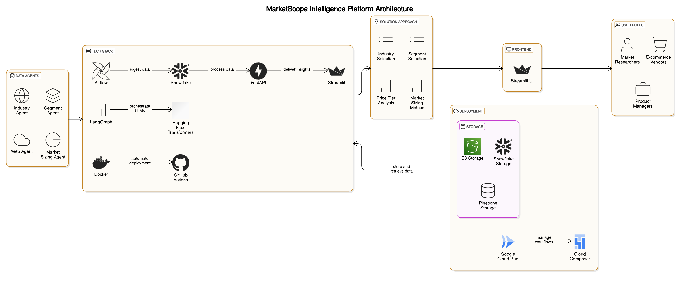

# 📊 MarketScope – AI-Powered Industry & Segment Intelligence Platform

## 👥 Team Members
- **Yash Khavnekar** – Data Collection, Web Scraping, Sentiment Analysis (MCP)
- **Shushil Girish** – Agent Integration, Backend + ETL (LangGraph, FastAPI, Airflow)
- **Riya Mate** – Frontend, Documentation, Codelabs

---

## 📌 Project Overview

**MarketScope** is a scalable AI-powered market intelligence platform designed to democratize access to industry insights. It integrates **structured data** from Snowflake Marketplace with **real-time unstructured data** like product reviews and pricing from leading retailers (Amazon, Target, Walmart). Informed by foundational marketing literature (e.g., *Philip Kotler’s Marketing Management*), the platform delivers pricing analysis, sentiment breakdowns, and market sizing (TAM/SAM/SOM) to help startups, SMBs, and analysts explore opportunities without costly reports or consultants.

---

## 🧠 Key Features

### For Market Researchers & Analysts
- 📊 Explore U.S. industry outlooks and segment trends
- 💡 Identify underserved market tiers via TAM/SAM/SOM metrics
- 🧠 Receive strategy insights aligned with proven marketing frameworks

### For E-commerce Vendors & Product Managers
- 🔍 Understand price-tier positioning (Cheap, Average, Luxury)
- 💬 Analyze sentiment from product reviews
- 📈 Generate strategic go-to-market recommendations

---

## 🔧 Architecture Overview



- **Frontend**: Streamlit (exploratory dashboard)
- **Backend**: FastAPI
- **Agents**: LangGraph + MCP (Model Context Protocol)
- **ETL Pipelines**: Apache Airflow
- **Data Sources**:
  - Structured: [Snowflake Marketplace – Industry & Segment Data](https://app.snowflake.com/)
  - Unstructured: Web scraping (reviews) + Web search (pricing)

---
## File Structure
```
MarketScope-AI-Powered-Industry-Segment-Intelligence-Platform/
│
├── Airflow/                            # Airflow pipeline components
│   ├── dags/                           # Airflow DAGs
│   │   └── book_to_vector_pipeline.py  # PDF processing pipeline
│   ├── config/                         # Configuration files
│   │   └── book.json                   # Book processing config
│   └── utils/                          # Utility modules
│       ├── mistralparsing_userpdf.py   # PDF parsing
│       └── chunking.py                 # Text chunking utilities
│
├── mcp_server/                         # Master Control Program server
│   ├── __init__.py
│   ├── server.py                       # Main MCP server implementation
│   ├── config.py                       # Server configuration
│   ├── models.py                       # Data models for MCP
│   ├── utils/                          # MCP utilities
│   │   ├── __init__.py
│   │   ├── auth.py                     # Authentication utilities
│   │   └── logging.py                  # Logging configuration
│   └── services/                       # Core MCP services
│       ├── __init__.py
│       ├── session_manager.py          # Session management
│       ├── agent_registry.py           # Agent registration/discovery 
│       └── task_queue.py               # Task scheduling
│
├── agents/                             # Specialized agents
│   ├── __init__.py
│   ├── base_agent.py                   # Base agent class
│   ├── analysis_agent/                 # Analysis agent
│   │   ├── __init__.py
│   │   ├── server.py                   # Analysis agent server
│   │   └── analyzers/                  # Analysis modules
│   │       └── market_analyzer.py      # Market analysis
│   │
│   ├── research_agent/                 # Research agent
│   │   ├── __init__.py
│   │   ├── server.py                   # Research agent server
│   │   └── knowledge_base.py           # Knowledge retrieval
│   │
│   └── marketing_agent/                # Marketing agent
│       ├── __init__.py
│       ├── server.py                   # Marketing agent server
│       └── generators/                 # Content generation
│           └── content_generator.py    # Marketing content
│
├── client/                             # Client applications
│   ├── cli/                            # Command line interface
│   │   └── marketscope_cli.py          # CLI tool
│   └── web/                            # Web interface
│       ├── app.py                      # Web app
│       ├── static/                     # Static assets
│       └── templates/                  # HTML templates
│
├── setup_pinecone.py                   # Pinecone setup script
├── requirements.txt                    # Dependencies
├── .env.example                        # Example environment variables
├── README.md                           # Project documentation
└── docker-compose.yml                  # Container orchestration
```

## 🧱 Tech Stack

| Layer              | Tools                                                                 |
|-------------------|------------------------------------------------------------------------|
| Backend API       | FastAPI, LangGraph, Hugging Face Transformers, MCP                    |
| Frontend          | Streamlit                                                              |
| Agents/LLMs       | GPT-4, LangGraph, Marketing Framework Injectors                        |
| ETL & Scheduling  | Apache Airflow (GCP Composer)                                          |
| Storage           | Snowflake, AWS S3, Pinecone                                            |
| CI/CD & DevOps    | Docker, GitHub Actions, GCP Cloud Run, Artifact Registry              |

---

## 🧩 System Flow

1. User selects industry and product segment via Streamlit dashboard.
2. FastAPI backend triggers LangGraph agents (Industry, Segment, Review, Strategy).
3. Agents fetch:
   - Industry/segment metadata from Snowflake
   - Review sentiment and pricing via web scraping/search
   - Strategic insights from Kotler-based frameworks
4. Insights rendered with TAM/SAM/SOM funnel + visual KPIs

---

## 🚀 Deployment

- **Frontend + Backend**: GCP Cloud Run (containerized with Docker)
- **Pipelines**: Cloud Composer (Airflow DAG orchestration)
- **CI/CD**: GitHub Actions for pipeline updates and app deployment
- **Secrets & Cache**: Redis + GCP Secret Manager

---

## 🗓️ Project Timeline

| Date       | Milestone                                      |
|------------|------------------------------------------------|
| Apr 1–4    | Dataset access, Industry/Segment definition    |
| Apr 5–7    | ETL development (Snowflake + Scraping)         |
| Apr 8–9    | KPI computation, price-tier analysis           |
| Apr 10     | Strategy framework + Agent integration         |
| Apr 11     | Streamlit UI + charting                        |
| Apr 12–13  | CI/CD + Deployment                             |
| Apr 14     | Final presentation + documentation             |

---

## ✅ Goals

- Democratize access to industry research insights
- Automate market sizing (TAM/SAM/SOM) and tier classification
- Achieve 90%+ review sentiment classification accuracy
- Provide book-informed strategic Q&A based on marketing theory

---
## 📚 Detailed Proeject Explanation

- [Google CodeLabs](https://codelabs-preview.appspot.com/?file_id=1_936snjPYvoj-RmfO5Vcm2G8xzjVTv0XGRy5wHlFiCo#0)

---

## 📚 Resources & References

- [FastAPI Docs](https://fastapi.tiangolo.com/)
- [Streamlit Docs](https://docs.streamlit.io/)
- [Airflow + Snowflake Guide](https://www.astronomer.io/docs/)
- [LangGraph MCP Announcement](https://changelog.langchain.com/)
- [Marketing Management – Philip Kotler](https://www.pearson.com/)

---

## ⚠️ Known Challenges & Solutions

| Challenge               | Mitigation Strategy                              |
|------------------------|--------------------------------------------------|
| Pricing inconsistencies| Normalize via multiple search sources           |
| Review data quality    | Filter + summarize via LLM pipelines            |
| Agent coordination     | LangGraph control flows with fallback handlers  |
| Data latency           | Optimize Airflow + cache recent results         |

---

## 📽️ Demo

Coming soon – A walkthrough showing industry selection, segment drilldown, and strategy Q&A!

---

## 📄 License

This project is developed for educational purposes and is licensed under the [MIT License](LICENSE).
